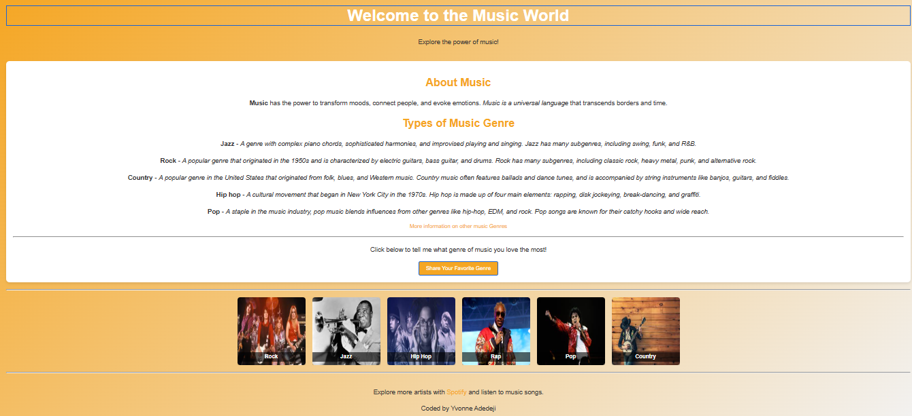

# music-landing-page

## 📌 Description
This project is a simple music-themed landing page that introduces visitors to different music genres and provides an interactive way for users to share their favourite music genre. The page features an aesthetically pleasing design with a vibrant background, smooth animations, and a gallery showcasing various music genres, including Rock, Jazz, Hip Hop, Rap, Pop, and Country.

The landing page includes an "About Music" section, detailed descriptions of various music genres, and a button for users to share their favourite genre. There's also a gallery with images representing each genre, as well as a footer with links to further explore music on platforms like Spotify. The page is responsive, ensuring a great user experience across devices.

## 🛠 Prerequisites
A web browser (Chrome, Firefox, Safari, etc.) to view the page.
No specific server setup is required as this is a static HTML, CSS, and JavaScript project.

## 📋 Criteria
* A clean, visually appealing design using a modern gradient background.
* Interactive elements like buttons to engage with users.
* Images of different music genres with captions and smooth hover effects.
* Responsive design that adjusts content based on the screen size.
* Clear and readable typography.
* Simple JavaScript functionality to gather user inputs on favourite music genre.
 
 ## 💻 Technologies Used
This project was built using:
* HTML
* CSS
* JavaScript
* External Links: Spotify and a resource for learning more about music genres.
* External Image URLs: For displaying genre-related images.

## 🚀 Installation
No installation required. Simply open the web application in your browser.

## 📚 Usage
1. Upon loading the page, you will see a welcome message with the heading "Welcome to the Music World."
2. Scroll down to explore the "About Music" section with descriptions of various music genres.
3. Click the "Share Your Favourite Genre" button to enter your name and favourite music genre.
4. View the interactive gallery showcasing images of each genre.
5. Explore more music via the links provided in the footer.

## 🔗 Live Demo & Repository
Application can be viewed here: 
* [Live](https://ya-music-landing-page.netlify.app/)

* [Repository](https://github.com/yvonnesarah/music-landing-page)

## 🖼 Screenshot
Below is a preview of Music Landing Page:

## 👥 Credit
Spotify for music streaming and inspiration.
Image assets are sourced from public image URLs.

## 📜 License
This project is open-source. For licensing details, please refer to the LICENSE file in the repository.

## 📬 Contact
You can reach me at 📧 yvonneadedeji.sarah@gmail.com.
