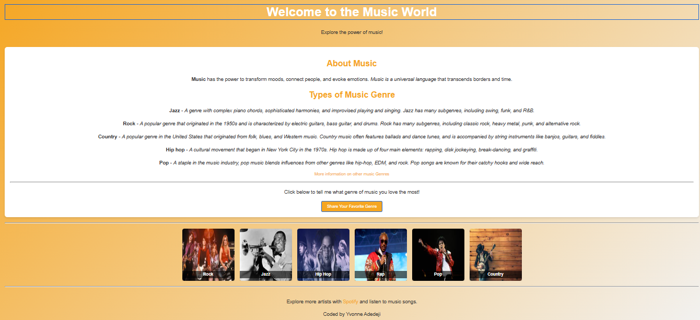

# music-landing-page

## 📌 Description
This project is a simple music-themed landing page that introduces visitors to different music genres and provides an interactive way for users to share their favourite music genre. The page features an aesthetically pleasing design with a vibrant background, smooth animations, and a gallery showcasing various music genres, including Rock, Jazz, Hip Hop, Rap, Pop, and Country.

The landing page includes an "About Music" section, detailed descriptions of various music genres, and a button for users to share their favourite genre. There's also a gallery with images representing each genre, as well as a footer with links to further explore music on platforms like Spotify. The page is responsive, ensuring a great user experience across devices.

## 🛠 Prerequisites
To run and interact with this project, ensure you have:
* 🌐 A modern web browser such as Chrome, Firefox, Safari, or Edge
* 📶 An active internet connection (required for loading external images and links like Spotify)
* 🧠 Basic understanding of web navigation (optional, for better user interaction)

No installation, build tools, or server setup is required since this is a static web application.

## 📋 Features
* A clean, visually appealing design using a modern gradient background.
* Interactive elements like buttons to engage with users.
* Images of different music genres with captions and smooth hover effects.
* Responsive design that adjusts content based on the screen size.
* Clear and readable typography.
* Simple JavaScript functionality to gather user inputs on favourite music genre.
 
 ## 💻 Technologies Used
This project was built using:
* HTML
* CSS
* JavaScript
* External Links: Spotify and a resource for learning more about music genres.
* External Image URLs: For displaying genre-related images.

## 🚀 Installation
No installation required. Simply open the web application in your browser.

## 📚 Usage
1. Upon loading the page, you will see a welcome message with the heading "Welcome to the Music World."
2. Scroll down to explore the "About Music" section with descriptions of various music genres.
3. Click the "Share Your Favourite Genre" button to enter your name and favourite music genre.
4. View the interactive gallery showcasing images of each genre.
5. Explore more music via the links provided in the footer.

## 🔗 Live Demo & Repository
Application can be viewed here: 
* [Live](https://ya-music-landing-page.netlify.app/)

* [Repository](https://github.com/yvonnesarah/music-landing-page)

## 🖼 Screenshot
Below is a preview of Music Landing Page:

## 🚀 Future Improvements
* 🎧 Music Preview Integration - Embed playable music snippets (e.g., via Spotify API) so users can listen to sample tracks from each genre directly on the page.
* 📝 User Submissions Display - Store and display users’ favourite genres dynamically, creating a shared community section.
* 🔍 Search & Filter Functionality - Allow users to search and filter music genres for quicker navigation and discovery.
* 🌙 Dark/Light Mode Toggle - Add a theme switcher to improve accessibility and user preference.
* 📱 Enhanced Mobile Experience - Further optimize animations and layouts specifically for smaller screens.
* 💾 Local Storage Support - Save user preferences (name and favourite genre) locally so they persist across sessions.
* 🌐 Backend Integration - Connect to a backend service to store user data and enable more interactive features.
* 🎵 Expanded Genre Library - Add more genres and subgenres with richer descriptions and visuals.

## 👥 Credit
This project makes use of the following resources:

🎵 Spotify – for music inspiration and external music exploration links

🖼 Public Image Sources – genre-related images used in the gallery (via external URLs)

💡 Open Web Resources – for general information about music genres and design inspiration

## 📜 License
This project is open-source. For licensing details, please refer to the LICENSE file in the repository.

## 📬 Contact
You can reach me at 📧 yvonneadedeji.sarah@gmail.com.
