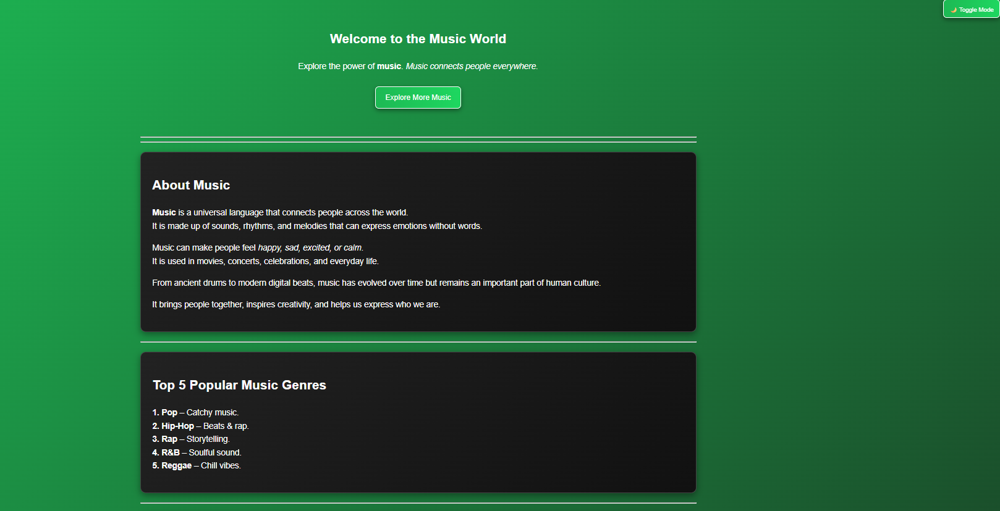
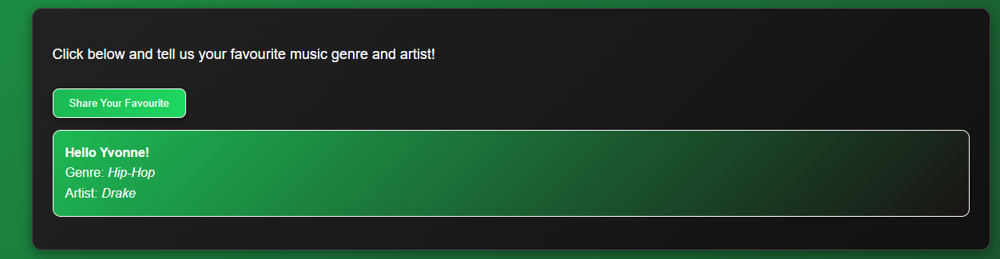
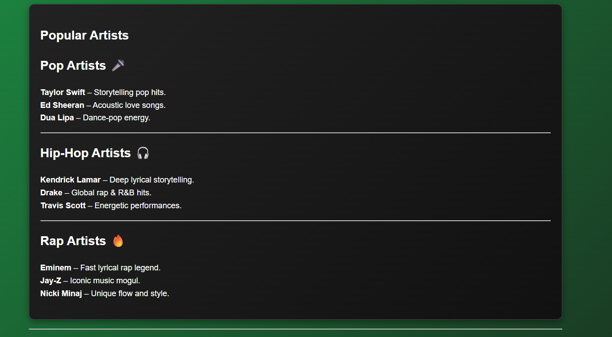
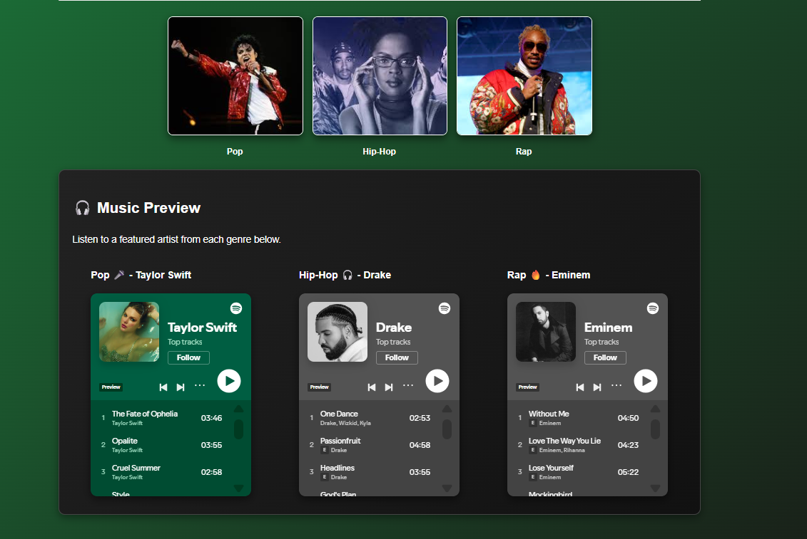
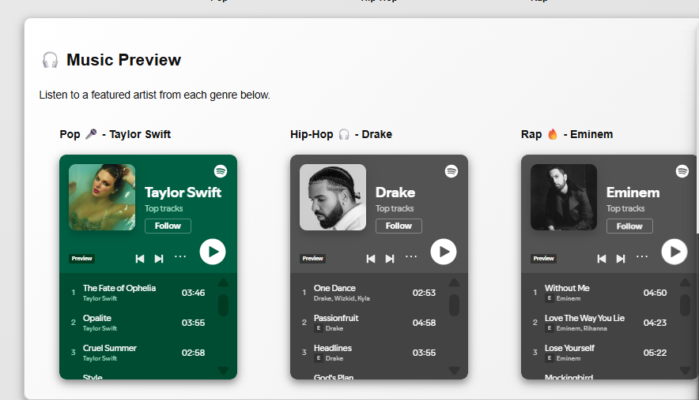

# music-landing-page

## 📌 Description
The Music Landing Page is a visually engaging and responsive static web application that introduces users to different music genres. It provides an interactive experience where users can explore genres, discover popular artists, listen to embedded Spotify previews, and share their personal music preferences.

The page features a vibrant gradient UI, smooth hover animations, a theme toggle (light/dark mode), and a clean layout highlighting genres such as Pop, Hip-Hop, and Rap. It also includes simple JavaScript interactivity where users can input their name, favourite genre, and artist to receive a personalized response.

## 🛠 Prerequisites
To run and interact with this project, ensure you have:
* 🌐 A modern web browser such as Chrome, Firefox, Safari, or Edge
* 📶 Internet connection (for external images and Spotify link)

No installation, build tools, or server setup is required since this is a static web application.

## 📋 Features
* 🎨 Modern gradient background design
* 🌙 Light/Dark mode toggle
* 🖼 Interactive music genre gallery
* 🖱 Smooth hover animations on images
* 📱 Fully responsive layout (mobile & desktop)
* 🎵 Informational sections about music genres
* 👨‍🎤 Popular artist listings (Pop, Hip-Hop, Rap)
* 🎧 Embedded Spotify music previews
* 🔘 Interactive button for user input (name, genre, artist)
* 💬 Personalized response based on user input
* 🔗 External link to Spotify for music exploration
* ⚡ Lightweight vanilla JavaScript interactivity

 ## 💻 Technologies Used
This project was built using:
* HTML
* CSS
* JavaScript
* External Links: Spotify Embed (iFrames)
* External Image URLs: For displaying genre-related images.

## 🚀 Installation
No installation required. Simply open the web application in your browser.

## 📚 Usage
1. Open the landing page in your browser
2. Explore music genres and artists
3. Scroll through the gallery
4. Toggle between light and dark mode 🌙
5. Click “Share Your Favourite”
6. Enter your name, favourite genre, and artist
7. Receive a personalized message 🎵
8. Listen to Spotify previews embedded on the page

## 🔗 Live Demo & Repository
Application can be viewed here: 
* [Live](https://yvonnesarah.github.io/music-landing-page/)

* [Repository](https://github.com/yvonnesarah/music-landing-page)

## 🖼 Screenshot(S)
Before Design

Music Landing Page

After Design

Music Landing Page

Share Favourite

Popular Artists

Images and Music Preview

Music Preview - Light Mode - Toggle

## 👥 Credit
Designed and developed by Yvonne Adedeji.

This project makes use of the following resources:

🎵 Spotify – Embedded music previews and inspiration
🖼 Public Image Sources – Music genre visuals

## 📜 License
This project is open-source. For licensing details, please refer to the LICENSE file in the repository.

## 📬 Contact
You can reach me at 📧 yvonneadedeji.sarah@gmail.com.
